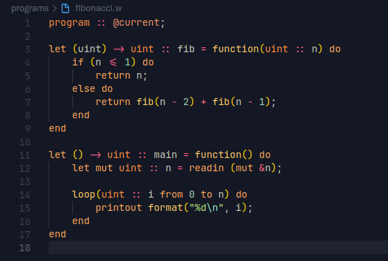

# W temporary VS Code extension

I made this extension real quick to be able to design the language in a more colorful and meaningful environment.
However, it is a very dumb extension so don't expect it to work perfectly.

Only support context-free syntax highlighting, btw.

## Installation

### Linux/macOS

#### Using the script

Assuming that you have `ocaml` installed on your linux machine, run:

```sh
ocaml linux_install.ml
```

#### Manually

Create a folder named `w.w-language-0.0.1` in `$HOME/.vscode/extensions/` and put the files inside.  
Normally, you just have to reload VS Code.

### Windows

No idea what VS Code extensions' path is. Perhaps in `C:\Program Data\`? If you find it, just do the same as for Linux/macOS but using this path instead.

## Screenshots

Here is a snippet of what it looks like with a simple fibonacci program.



> Theme: [Mayukai Mirage](https://marketplace.visualstudio.com/items?itemName=GulajavaMinistudio.mayukaithemevsc)
